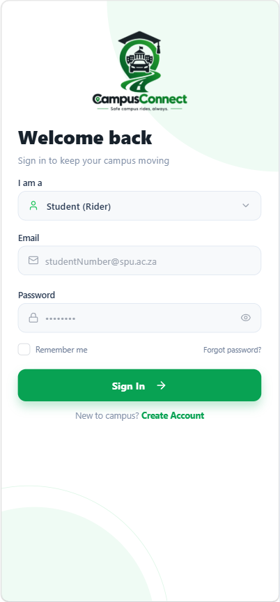
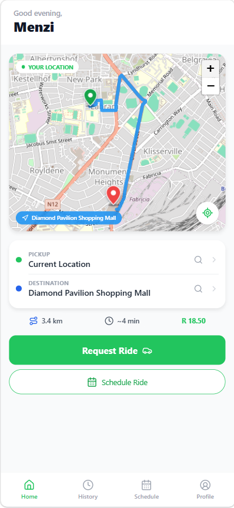
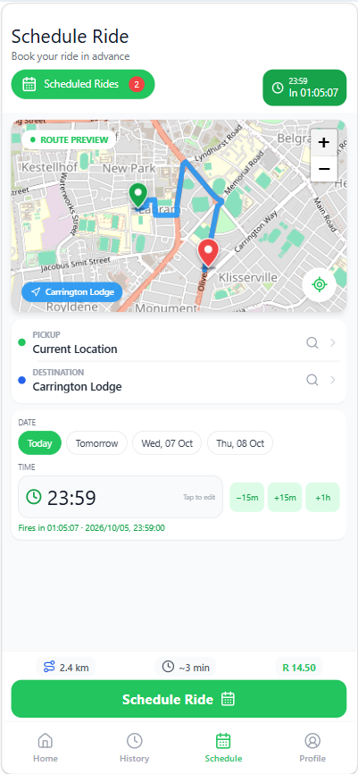
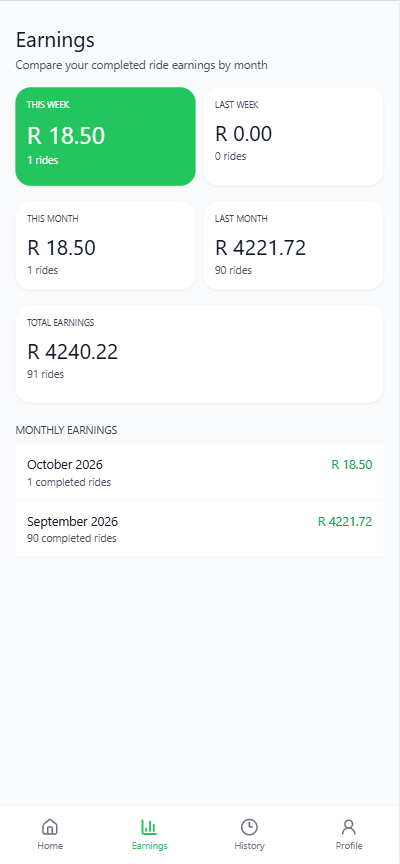
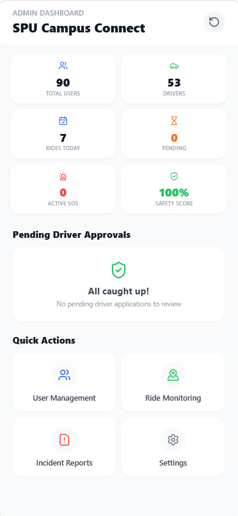
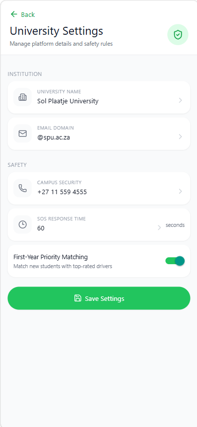
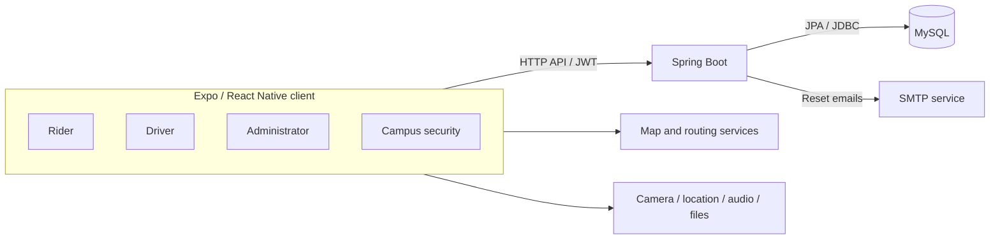

<div align="center">

# CampusConnect

### Safe campus rides, always.

A campus transport and safety platform connecting students, drivers, university administrators, and campus security.


[Explore the app](#a-look-inside) · [Run locally](#run-locally) · [Architecture](#architecture) · [Documentation](#documentation) · [Contribute](#contributing)

</div>

---

## Why CampusConnect?

Getting to class, returning to residence, or travelling across town should be easy to arrange. CampusConnect brings ride booking, driver operations, and campus safety workflows into one application, with dedicated experiences for each role.

The interface is configured around Sol Plaatje University in Kimberley, South Africa, with rand-denominated fares and university settings. Riders can request or schedule transport, drivers can manage trips and earnings, and university teams can review applications, monitor rides, and handle reported incidents.

**Project status:** an actively developed full-stack prototype with web validation and Android/iOS client support. Public deployment, production hardening, and complete physical-device validation remain open work. See [current limitations](#current-limitations) before deploying.

## A look inside

<table>
  <tr>
    <td align="center" width="33%"><strong>Welcome & sign-in</strong><br><br></td>
    <td align="center" width="33%"><strong>Book a campus ride</strong><br><br></td>
    <td align="center" width="33%"><strong>Plan your next trip</strong><br><br></td>
  </tr>
  <tr>
    <td align="center"><strong>Driver earnings</strong><br><br></td>
    <td align="center"><strong>University operations</strong><br><br></td>
    <td align="center"><strong>Campus configuration</strong><br><br></td>
  </tr>
</table>

Screenshots were supplied in the project owner's *Campus Connct full picture document.docx* and extracted without modification. They illustrate captured app states; displayed fares, counts, and safety indicators are not measured service results or guarantees. These captures may differ from the latest code.

## Built for four roles

| Role | Experience |
| --- | --- |
| **Student / rider** | Select pickup and destination, preview routes and fares, request or schedule a ride, follow an active trip, message the driver, review trip history, and leave a rating. |
| **Driver** | Submit an application, switch availability, review and accept requests, progress through trip stages, update location, message riders, and review earnings and completed trips. |
| **Administrator** | Review driver applications, approve or reject drivers, manage users, monitor rides, inspect incidents and audio evidence, and configure university settings. |
| **Campus security** | Monitor active rides, review SOS alerts and available evidence, record dispatch actions, and inspect resolved alerts. |

### Features that connect the experience

- **Accounts and recovery:** role-based navigation, JWT authentication, BCrypt password hashing, and email reset codes with expiry and attempt controls.
- **Ride coordination:** map-based booking, scheduling, request handling, trip status updates, history, and ratings.
- **Communication:** ride-specific messaging and trip-sharing controls.
- **Safety workflows:** rider and driver SOS reporting, GPS context, audio evidence, and a security review queue.
- **Responsive layouts:** shared navigation and layouts for phone, tablet, and desktop web views.
- **University oversight:** driver approvals, user management, ride monitoring, incident reporting, and configurable institution details.

Face capture, saved payment details, and payment records are present, but biometric identity checks and payment processing are not complete integrations. See [current limitations](#current-limitations).

## How a ride works

1. **Choose the journey.** A rider selects pickup and destination and reviews the route and fare estimate.
2. **Request transport.** The request becomes available to eligible drivers; drivers review details and accept or decline.
3. **Follow the trip.** The assigned driver advances trip status while rider and driver can exchange messages.
4. **Finish and review.** Completed trips appear in history and support ratings and driver earnings summaries.
5. **Report a concern when needed.** An SOS report can attach location and audio evidence for campus security to review.

For a guided walkthrough, use the [demo script](docs/report/demo-script.md). Validate emergency workflows with synthetic alerts.

## Architecture



The client starts at `mobile/index.js` → `mobile/App.tsx`. React Navigation handles screens, Axios handles API requests, and shared layout components keep navigation and content responsive. Web maps use Leaflet; native mapping uses React Native Maps.

The backend serves `/api` on port `8080`. Spring Security and JWT filtering authenticate requests; Spring Data JPA and selected JDBC operations persist accounts, trips, messages, settings, and incident data. Important live views refresh through **client polling**. An included WebSocket dependency does not establish an operational WebSocket transport.

| Layer | Technologies |
| --- | --- |
| Application | Expo 57, React Native 0.86, React 19.2, TypeScript 6 |
| Navigation & networking | React Navigation, Axios, AsyncStorage |
| Maps & device features | Leaflet, React Native Maps, Expo camera/location/audio/file APIs |
| Backend | Java 25, Spring Boot 3.5, Spring Security, Spring Data JPA, JDBC |
| Authentication | JWT via JJWT, BCrypt |
| Persistence & email | MySQL, Spring Mail / SMTP |

Versions above describe the repository manifests. Detailed component and data notes are in [architecture](docs/architecture.md) and the [data dictionary](docs/report/data-dictionary.md).

## Run locally

### Prerequisites

- **JDK 25** and Maven available on your terminal path.
- **Node.js and npm** compatible with the checked-in Expo dependencies.
- A local **MySQL** server and an account permitted to create and update a disposable development database.
- Two terminals: one for the backend, one for Expo.
- For native development: Android SDK/emulator, or macOS with Xcode for iOS.

The commands below use PowerShell. On other shells, adapt environment assignments and use `npm` / `mvn` in place of `npm.cmd` / `mvn.cmd`.

### 1. Get the project

```powershell
git clone https://github.com/Menzi-dev/Campus-Ride-Connect.git
Set-Location Campus-Ride-Connect
```

If you already downloaded the project, open the repository directory containing `backend`, `mobile`, and this README.

### 2. Configure and start the backend

Set these values in the **same terminal** that will run Spring Boot. Replace the placeholders with your local settings; never commit credentials.

```powershell
$env:SPRING_DATASOURCE_URL = 'jdbc:mysql://localhost:3306/campus_connect_dev?createDatabaseIfNotExist=true&useSSL=false&allowPublicKeyRetrieval=true&serverTimezone=UTC'
$env:SPRING_DATASOURCE_USERNAME = '<your-local-mysql-user>'
$env:SPRING_DATASOURCE_PASSWORD = '<your-local-mysql-password>'
$env:APP_JWT_SECRET = '<your-random-secret-at-least-32-UTF8-bytes>'

Set-Location backend
mvn.cmd spring-boot:run
```

The backend listens at `http://localhost:8080`; the API base is `http://localhost:8080/api`.

**Database setup:** local JPA configuration uses `ddl-auto: update`, but historical SQL and entity mappings are not fully aligned. Some features also depend on tables used through JDBC. Treat the first startup as development setup, not a verified clean installation. Review [database setup notes](docs/deployment.md) and relevant scripts in `database/mysql/` if a table is missing. Do not run all migrations blindly: some overlap, and `fix_rides_table.sql` rebuilds the rides table.

### 3. Start the web app

In a second terminal, from the repository root:

```powershell
Set-Location mobile
npm.cmd ci
npm.cmd run web -- --port 8083
```

Open `http://localhost:8083`. Keep both terminals running. API-backed screens need the backend and database; an Expo preview alone does not provide them.

### 4. Connect an emulator or phone

From `mobile`, use `npm.cmd start` for the Expo development server, `npm.cmd run android` for an Android native build, or `npm.cmd run ios` on a configured Mac. Native builds need the corresponding platform toolchain; camera and audio behavior require device checks.

API host selection lives in [`mobile/src/services/ApiClient.ts`](mobile/src/services/ApiClient.ts):

| Target | Backend host |
| --- | --- |
| Local web browser | Browser hostname, normally `localhost` |
| Android emulator | `10.0.2.2` |
| iOS simulator | `localhost` |
| Physical Android / iPhone | Set `LOCAL_IP` to your computer's reachable LAN address |

For a phone, put both devices on a reachable network and allow backend port `8080` through your local firewall. LAN-hosted web previews may also need an explicit development CORS origin in the backend configuration.

### Optional: password reset email

The local launcher prompts for a Gmail sender address and a hidden App Password, then starts the backend with SMTP settings:

```powershell
# From the repository root; stop the existing backend first.
.\backend\run-with-gmail.ps1
```

Set the database and JWT environment variables in that terminal too. See [password reset email setup](docs/password-reset-email.md) for sender requirements and environment details. Reset email delivery requires working SMTP configuration.

### Common setup issues

| Symptom | What to check |
| --- | --- |
| App opens but requests fail | Backend is running on `8080`, the API host matches your device, and the firewall permits the connection. |
| Browser reports a CORS error | The preview origin is allowed by `SecurityConfig`; LAN origins are not covered by localhost rules. |
| Backend cannot connect to MySQL | Server availability, database privileges, and the datasource variables in the backend terminal. |
| A screen reports a missing table | Compare entity mappings and required JDBC tables with [deployment notes](docs/deployment.md) before applying a relevant script. |
| Password reset email does not arrive | SMTP sender and App Password configuration; consult [email setup](docs/password-reset-email.md). |
| Java compilation fails | Both Java and Maven are using JDK 25. |

## Repository guide

```text
Campus-Ride-Connect/
├── backend/                 Spring Boot API, security, services and tests
│   └── src/
│       ├── main/            Java source and application configuration
│       └── test/            Service and integration tests
├── mobile/                  Expo / React Native application
│   ├── App.tsx              Application navigation and entry UI
│   ├── src/                Screens, components, context and services
│   └── scripts/            Browser layout and workflow checks
├── database/mysql/          SQL schema, historical migrations and maintenance
├── docs/                    Architecture, API, setup and testing notes
│   ├── images/              Selected screenshots for this README
│   └── report/              Report, diagrams, data dictionary and demo guide
└── submission/              Academic submission package
```

## API at a glance

Local base URL: `http://localhost:8080/api`. Protected calls use `Authorization: Bearer <token>`. Most requests use JSON; registration and evidence uploads include multipart requests.

| Area | Representative endpoints |
| --- | --- |
| Authentication | `POST /auth/register`, `POST /auth/login` |
| Recovery | `POST /auth/password-reset/request`, `/auth/password-reset/verify`, `/auth/password-reset/confirm` |
| Rider trips | `POST /rides/request`, `GET /rides/active`, `GET /rides/history` |
| Driver requests | `GET /driver/requests`, `POST /driver/requests/{id}/accept` |
| Messaging | `GET /rides/{rideId}/messages`, `POST /rides/{rideId}/messages` |
| Emergency reporting | `POST /rides/{id}/sos`, `PUT /rides/{id}/sos/{alertId}/audio` |
| Administration | `GET /admin/dashboard/stats`, `POST /admin/driver-approvals/{id}/approve` |
| Security | `GET /security/sos`, `POST /security/sos/{id}/dispatch` |

See the [API inventory](docs/api-spec.md) and controller source for exact fields, role requirements, and additional endpoints. The inventory is source-based rather than a generated OpenAPI contract.

## Validation

Run the TypeScript check from `mobile`:

```powershell
npm.cmd run typecheck
```

Run backend tests from `backend`:

```powershell
# Repository and email dependencies are mocked in these service tests.
mvn.cmd "-Dtest=AuthServiceTest,PasswordResetServiceTest" test

# Complete suite: requires local MySQL and an isolated test database.
mvn.cmd test
```

The test datasource is configured in `backend/src/test/resources/application.properties` to use `campus_connect_tests`. Ensure that account has appropriate permissions, and never override it with an application database.

Browser checks use a running Expo preview and Playwright with intercepted API responses. Follow the [browser setup instructions](docs/responsive-layout.md), then run from `mobile`:

```powershell
npm.cmd run check:responsive
npm.cmd run check:pages
node scripts/check-admin-approvals.cjs
node scripts/check-normal-rating.cjs
npm.cmd run check:driver-sos
```

Recorded project evidence on **5 October 2026** includes a passing TypeScript check and a complete backend suite of **23 tests with no failures or errors**. Browser evidence covers responsive layouts, driver approvals, ride ratings, and driver SOS workflows with synthetic responses. These are recorded results, not a claim that every integration or device has been validated. See [testing notes](docs/testing.md) for scope and remaining checks.

## Current limitations

The repository implements substantial application workflows, with several integrations and deployment requirements still to finish:

| Area | Current boundary |
| --- | --- |
| Identity verification | Face uploads and camera UI exist; biometric matching and liveness verification are not implemented. |
| Payments | Saved-card display metadata and pending payment records exist; there is no evidenced payment-provider integration or actual charging. |
| Live updates | Important views use polling; operational WebSocket messaging is not established. |
| SOS operations | Alerts, evidence, and dispatch actions are application workflows; real emergency response and native permissions need separate validation. |
| Database installation | Historical migrations and JPA mappings need consolidation and a verified clean-install path. |
| Production security | Privileged self-registration, startup credential resets, response redaction, token handling, and upload retention need hardening. |
| Deployment & devices | Public deployment, native hardware checks, offline behavior, and full trip integrations remain to be validated. |

See the [security review](docs/security.md) for the observed blockers. Use disposable data while developing and keep credentials, student records, identity documents, and private audio out of public commits.

## Documentation

| Guide | What it covers |
| --- | --- |
| [Architecture](docs/architecture.md) | Client, API, database, and external dependencies |
| [Requirements](docs/requirements.md) | Functional scope and project requirements |
| [API inventory](docs/api-spec.md) | Source-based endpoint reference |
| [Local setup & deployment](docs/deployment.md) | Environment configuration and database caveats |
| [Security review](docs/security.md) | Implemented controls and production blockers |
| [Testing evidence](docs/testing.md) | Commands, recorded results, and coverage limits |
| [Responsive layout guide](docs/responsive-layout.md) | Layout behavior and Playwright setup |
| [Password reset email](docs/password-reset-email.md) | SMTP launcher and sender configuration |
| [Demo script](docs/report/demo-script.md) | Guided project walkthrough |
| [Screen catalogue](docs/report/screen-catalogue.md) | Registered routes and evidence types |
| [Data dictionary](docs/report/data-dictionary.md) | Entities, fields, and relationship notes |
| [Project report](docs/report/CampusConnect-Final-Report.pdf) | Downloadable technical and academic report |

## Next milestones

- Consolidate database migrations and verify setup against an empty database.
- Restrict privileged account creation, isolate development seeds, and complete ownership and role checks.
- Validate full trip workflows, concurrent driver acceptance, and native location/camera/audio permissions.
- Integrate a payment provider and define appropriate identity-verification requirements.
- Prepare HTTPS deployment, secret management, backups, and evidence-retention controls.
- Conduct the planned usability study and record actual participant results.

## Contributing

Issues and focused pull requests are welcome. Describe the affected role and screen, provide reproducible steps, and include the expected behavior. For UI changes, include phone and desktop screenshots using test data.

1. Create a branch for one change.
2. Keep updates consistent with the existing client and backend structure.
3. Run the checks relevant to your change and explain their scope in the pull request.
4. Update setup or API documentation when behavior changes.
5. Exclude secrets, real account records, uploaded documents, and recordings.

Use the repository's [issue tracker](https://github.com/Menzi-dev/Campus-Ride-Connect/issues) for bugs and feature proposals. Report security concerns privately to the maintainer rather than including sensitive exploit details in a public issue.

## Maintainer & license

Maintained by [Menzi-dev](https://github.com/Menzi-dev). The screenshots and university configuration show the project's campus context; they do not establish official institutional endorsement.

No license file is currently included. Ask the maintainer about permission before redistributing or reusing the project; a public repository alone does not grant an open-source license.

---

<div align="center">

**CampusConnect — bringing campus journeys and safety workflows together.**

[Back to top](#campusconnect)

</div>
